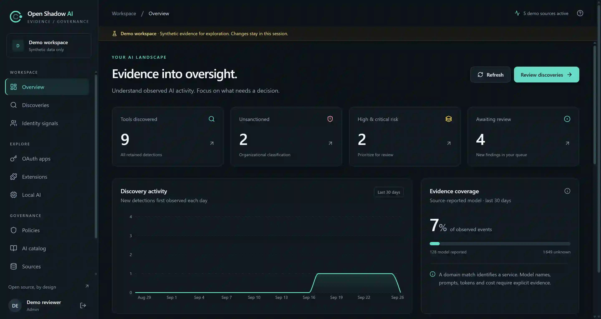

<p align="center"></p>

# Open Shadow AI

[English](README.md) | [Français](README.fr.md) | [简体中文](README.zh-CN.md)

[](https://github.com/alebgl77/open-shadow-ai/actions/workflows/ci.yml)
[](LICENSE)


**自托管 AI 发现，每项发现都有证据可查。**

了解环境中出现了哪些 AI 服务与工具、每条信号来自何处，以及它实际能够证明什么。在面向调查的界面中，汇集网络元数据、终端清单和 Microsoft 目录信号。

[专家实施与运维手册](docs/zh-CN/README.md) · [快速开始](#快速开始) · [文档与语言覆盖范围](docs/README.md) · [部署（英文参考）](docs/deployment.md) · [生产环境验收验证（英文参考）](docs/production-qualification.md) · [采集器运维（英文参考）](docs/collector-operations.md) · [Microsoft 与 Active Directory（英文参考）](docs/microsoft.md) · [SSO 与 SCIM（英文参考）](docs/sso-scim.md) · [架构（英文参考）](docs/architecture.md) · [路线图](docs/zh-CN/roadmap.md)

> 本项目处于早期阶段，适用于评估和受控试点。每个部署仅服务一个组织。Docker、Kubernetes 和实际 Microsoft 环境需要在自身环境中完成运维验证；不声称获得认证或提供生产 SLA。

后端为开发预览版 **0.3.0**；独立终端代理为 **0.1.0**。英语、法语和简体中文手册提供等效的实施流程。详细参考资料和历史验证记录保留其声明的语言与各自来源的范围。

控制台在登录前后均提供英语、法语和简体中文。经过校验的浏览器本地语言偏好独立于身份验证；没有可用偏好或存储被阻止时，默认使用英语。原始来源数据与机器/API 标识保留原值。参见[语言覆盖范围](docs/README.md)。

这些语言选项由[提交 `7a12513`](https://github.com/alebgl77/open-shadow-ai/commit/7a12513eb1e1e3a800ba8d71f4726a3b5045b669)引入 `main`。已发布的 `v0.3.0` 预发行版位于提交 `49a58d7`，早于本地化功能。两个源代码修订均声明版本 `0.3.0`；核对功能可用性与 CI 证据时，应记录实际部署的准确提交。



## 动态发现示意

三幅无声、带有法语标注的动态图说明 AI 足迹、证据级别和采集器恢复。这些说明性示意图使用合成数据，与上方展示的实际界面不同。


[查看全部三幅示意图（英文参考）](docs/motion.md) · [打开或下载 MP4](docs/assets/motion/footprint.mp4) · [查看静态海报](docs/assets/motion/footprint.webp)

## 为什么选择本项目

- **可检查的证据。** 区分网络观测、已安装资产、目录清单和埋点报告的使用情况。
- **自主掌控的基础设施。** 自托管 API、队列、事件存储和界面。
- **循序渐进的采用方式。** 从一个日志来源或少量受管设备的试点开始。
- **开放的目录。** 审查并贡献分类所依据的签名。
- **如实呈现缺口。** 缺失信号保持未知；DNS 请求不能证明提示词或账单。

## 未来方向

看清足迹，理解风险，保持掌控。[六阶段路线图](docs/zh-CN/roadmap.md)规划了更丰富的发现、智能体可见性、可选本地分析、引用证据的调查、明确启用的使用管控，以及持续验收验证。每个未来阶段都有可测量的交付门槛；候选技术仍只是待评估的方案。

## 体验界面

前提条件：**Node.js 22.22.2+（22.x）**。启动独立界面演示：

```bash
cd frontend
npm ci
npm run demo
```

在开发服务器输出的本地地址打开 `/demo` 路径。该会话使用合成演示数据，不需要后端凭据，也不会连接你的目录或设备群。若要继续完整安装，先停止演示服务器并运行 `cd ..`。

## 快速开始

前提条件：Git、Python 3.12+，以及可正常使用的 Docker Engine 和 Compose v2。项目不附带 Docker 运行时。初始界面通过 HTTP 绑定本地主机；远程终端代理需要 HTTPS 反向代理。

```bash
git clone https://github.com/alebgl77/open-shadow-ai.git
cd open-shadow-ai
bash scripts/bootstrap.sh
docker compose config --quiet
docker compose up -d --build
docker compose exec -T api python /app/entrypoint.py python -m shadai.workers.redis_lifecycle reconcile --execute --legacy-writers-stopped
docker compose up -d --wait --wait-timeout 180 api ingest-worker correlation-worker purge-worker frontend
docker compose run --rm api python -m shadai.cli create-admin
```

在 Windows 上，用 `./scripts/bootstrap.ps1` 替代 Bash 引导脚本。两者都保留现有机密值与配置。使用 `-DryRun` 或 `--dry-run` 预览。

核对与重建之前，等待新工作进程初始化实际 Redis 组；如仍在初始化，则重试。升级时，在启动带索引的新版本之前，停止所有旧版写入程序/工作进程/重放客户端。就绪检查要求保留结构已完成核对与重建。有关故障行为及隔离演练，参见[队列保留（英文参考）](docs/queue-retention.md)与[验收验证（英文参考）](docs/production-qualification.md)。

打开 [localhost:3000](http://localhost:3000)。PostgreSQL 迁移由 `migrate` 服务在 API 启动之前执行；新的事件存储卷会加载两个 ClickHouse 结构文件。[更新现有安装（英文参考）](docs/deployment.md#updates)时，需要单独执行 ClickHouse 迁移。

采集器需要明确启用：

```bash
docker compose --profile syslog up -d
# After configuring Entra IDs and its separately provisioned client-secret file:
docker compose --profile entra up -d
```

AD 导出与终端安装由运维人员执行，流程见 [Microsoft 指南（英文参考）](docs/microsoft.md)。安装服务器不会自动扫描设备群。

管理员可以在**来源与覆盖范围**中注册限定范围的采集器，私下配置其一次性密钥，并执行轮换或撤销。终端、网络和 syslog 采集器具有设定上限的持久投递队列；流水线状态区分待处理工作、保留条目和未知的采集丢失。注册、重启恢复、经过身份验证的监控和身份保留见[运维指南（英文参考）](docs/collector-operations.md)。

可选 [OIDC 登录与 SCIM 预配（英文参考）](docs/sso-scim.md)管理控制台访问，支持 Microsoft Entra ID。基础部署关闭这两项功能，其凭据与清单采集器相互独立。本地管理员登录仍可用于恢复。

## 当前交付内容

| 能力 | 状态与实际边界 |
|---|---|
| React 调查界面、目录和治理流程 | 已实现；需使用自身数据评估 |
| DNS/代理解析器与 syslog 采集器 | 已实现；解析器和监听器必须与来源匹配 |
| [被动网络分析（英文参考）](docs/network-analysis.md) | Zeek/Suricata/TShark 元数据导入、可选离线 PCAP 或明确启用的实时传感器，以及 `/network` 证据视图；观测到名称不能证明 AI 请求 |
| 终端代理 | 已实现进程/容器/运行时/扩展清单；操作系统和设备群部署验证待完成 |
| Microsoft Entra 采集器 | 已实现服务主体清单与可选权限授予采集；AI 匹配需要审核后的应用 ID 映射；实际租户验证待完成 |
| 本地 Active Directory | 限定 OU 范围的只读 PowerShell 导出器；RSAT/实际 AD 验证待完成 |
| 通用事件接入 | 经过身份验证、批次设有上限；自定义适配器仍需自行集成 |
| 采集器注册与恢复 | 限定范围的一次性凭据、轮换/撤销、有上限的本地持久化队列及显式死信重放；须核对部署提交对应的原生/存储 CI 结果 |
| 模型/词元数/成本证据 | 接收明确提供的埋点元数据；网络日志无法生成这些值 |
| 其他目录（LDAP、Okta、Google Workspace） | 可使用自定义接入契约；原生连接器在规划中 |
| Docker Compose | 提供部署包及 CI 服务冒烟检查；首次运行需验证 |
| Kubernetes | 使用外部存储的基础配置；集群、入口、备份和扩容验证待完成 |
| OIDC SSO 与 SCIM 2.0 控制台预配 | 已实现可选子集并提供 Entra 配置指南；实际租户互操作验证待完成 |
| 隔离的多租户、自动化设备群管理 | 规划中；目前每个安装仅服务一个组织 |
| 在线阻断、提示词 DLP、完整行为分析 | 不在当前产品范围内 |

## 架构


[可编辑的 draw.io 图](docs/assets/architecture.drawio) · [Mermaid 与数据流（英文参考）](docs/architecture.md)

为保持兼容，Python 包名和环境变量前缀继续使用 `shadai`。项目的公开名称为 **Open Shadow AI**。

## 证据、隐私与边界

默认配置不存储 URL 路径、查询字符串或用户代理。接入时，路径（不含查询字符串）和用户代理在内存中与目录模式比较，匹配范围限定于各产品的主机；仅保留匹配的目录项。设置 `privacy.match_transient_signals: false` 可跳过该比较。用户名、设备标识和目录导出应视为个人或组织数据。根据部署情况设置保留期和访问权限。

每次观测的身份成员关系独立过期（默认最多 30 天）；显示的计数是观测到的不同标识，不是员工人数。可选的服务器假名化影响新处理，不会清理历史或明文本地队列。风险评分保留最近一次计算快照，并提供可空的计算时间和过期标记。历史清理是显式执行、范围受限的维护操作；参见[身份保留与假名化（英文参考）](docs/collector-operations.md#retain-and-pseudonymize-identities)。

DNS 解析表明与域名有关的联系，不表示已完成 AI 交互。已安装的扩展或目录应用表示存在或权限，不表示使用。模型标识属于声明的证据；词元总数与成本需要埋点。除非已与服务商账单核对，否则成本计算仍为估算。

未受管设备、未被观测的加密 DNS、本地工具、共享域名、SaaS 内嵌 AI 和绕过网关的流量都可能造成缺口。参见[覆盖指南（英文参考）](docs/collectors.md)与[市场分析（英文参考）](docs/market-analysis.md)。

## 参与贡献

阅读[贡献指南（英文参考）](CONTRIBUTING.md)，提交范围较小、可复现的变更，并为采集器提供合成测试样例。根据[安全策略（英文参考）](SECURITY.md)私下报告漏洞。

采用 [Apache-2.0](LICENSE) 许可证。版权所有：Open Shadow AI 贡献者。

有关容量与部署，参见[容量规划（英文参考）](docs/capacity.md)。吞吐量结论需要依据自身工作负载进行测量。
