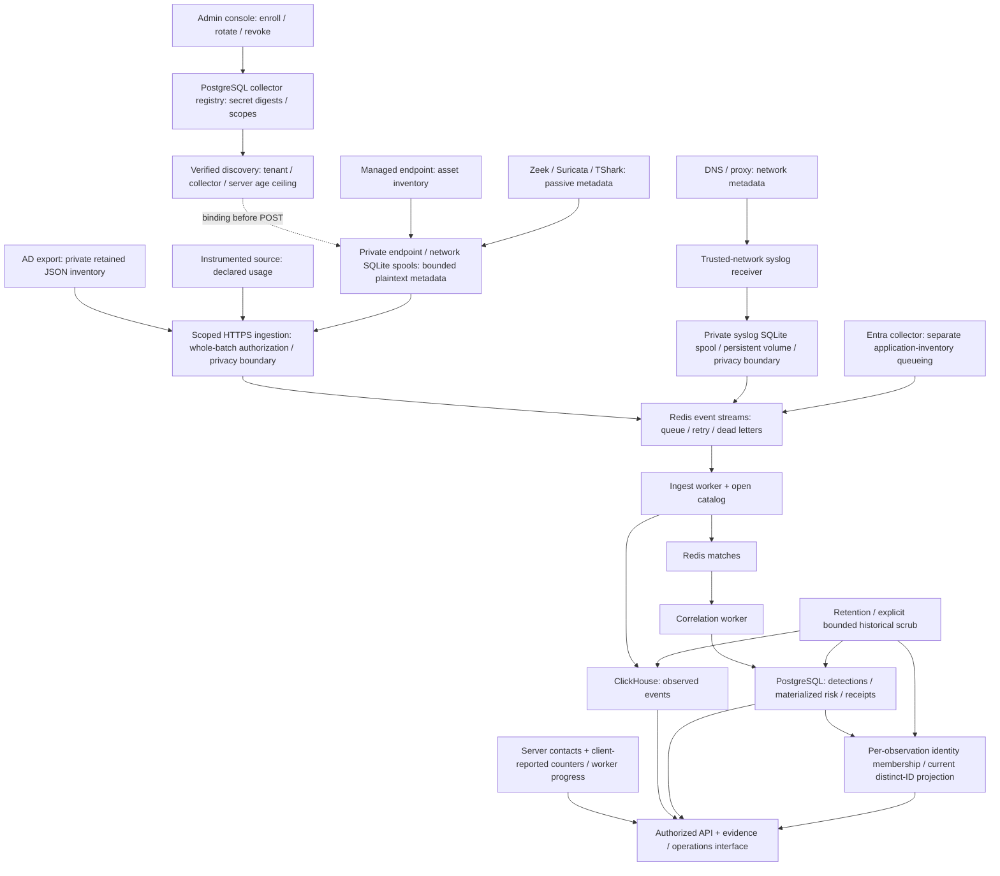

# Architecture

[Edit the overview diagram in diagrams.net](assets/architecture.drawio). The SVG is a presentation export of that overview. The Mermaid below adds the collector control plane, local queues and retention boundaries.

The diagram shows a single-organization install. It does not promise automatic identity joins or complete source coverage. AD export uses the event API; Entra can enqueue through the collector pipeline. The interface separates inventory and network observations from instrumented usage.

The [passive network collector](network-analysis.md) imports metadata files or locally dissects an offline PCAP; live capture requires an explicitly chosen interface. Only DNS/TLS/QUIC/HTTP metadata reaches ingestion. Stored network observations retain sensor ID, source timestamp, parser version, protocol and IPv4/IPv6 addresses; no employee identity is inferred. `/network` exposes imported observations to analysts and administrators without treating their volume as stronger confidence or AI request totals.

HTTP ingestion binds a scoped credential to an immutable collector, tenant and allowed source types. Discovery and age limits are verified and persisted before endpoint/network delivery, including after offline bootstrap. Local spools preserve stable bytes/IDs for at-least-once delivery within finite capacity and TTL; transport/capture losses remain unknown. Legacy shared-key access is explicitly unattributed and can be disabled after enrollment. Remote clients require HTTPS with certificate validation. The syslog receiver has a different trust boundary: its TCP/UDP messages are not cryptographically authenticated by the application. Restrict it to trusted network sources with firewall allowlists, and use a trusted TLS syslog relay where transport protection is required. A validated event schema does not authenticate the network sender.

A directory record does not demonstrate a model call. Model identifiers, token quantities and cost metadata require an instrumented source and retain their provenance. Cost estimates must not be presented as invoices. Unknown data stays unknown.

PostgreSQL stores operational state, per-observation identity membership and durable idempotency receipts; ClickHouse stores event evidence; Redis holds processing queues and retained source records plus bounded dead-letter pointers. Pending work, lag, retained entries and lifetime activity are distinct measurements. Worker progress and advisory client counters do not prove complete capture. Metrics require an administrator or an independent read-only bearer token.

Identity retention changes current counts independently of a materialized risk snapshot; `risk_score_stale` and nullable `risk_calculated_at` expose that difference. Optional server HMAC pseudonymization does not scrub history, plaintext local queues or backups. Historical maintenance requires quiescence and verified bounded mutations. Database backups must be coordinated with local spools, Redis/AOF policy and matching keys. See [collector operations](collector-operations.md), [deployment](deployment.md) and [capacity planning](capacity.md).
