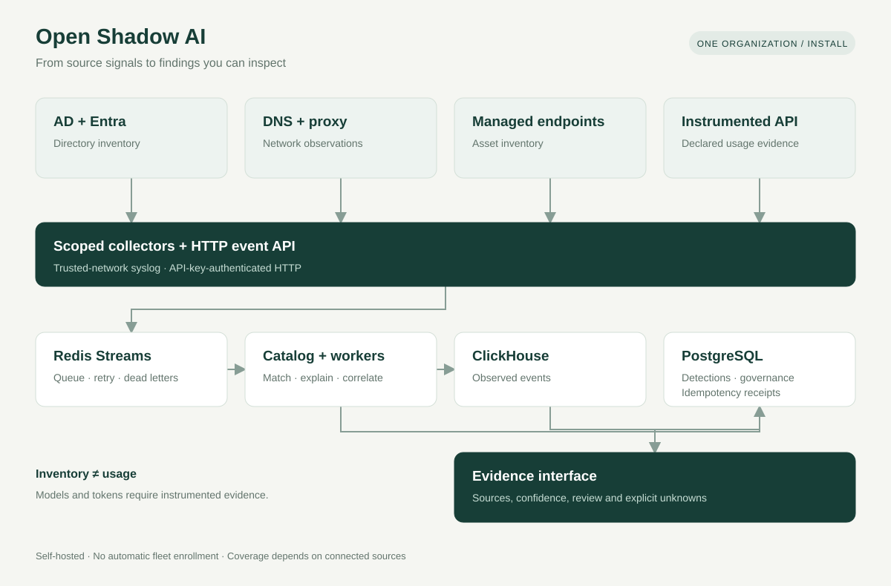
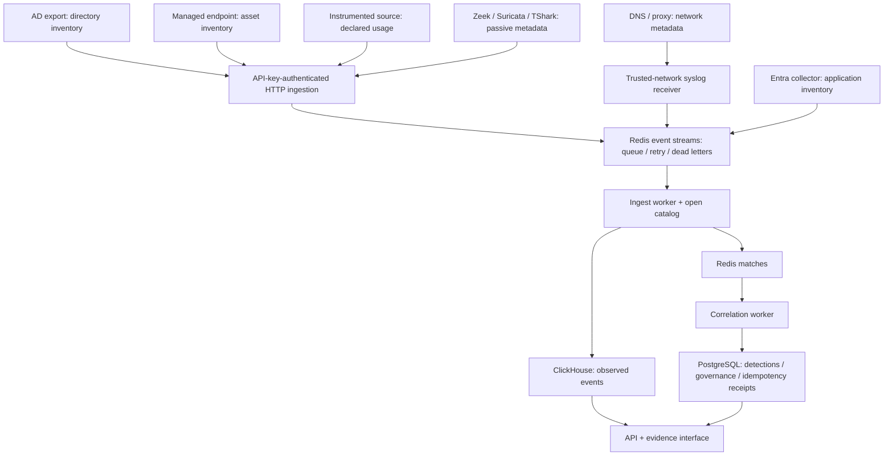

# Architecture

[Edit the diagram in diagrams.net](assets/architecture.drawio). All shapes and connectors are editable. The SVG is a presentation export of the same source layout.

The diagram shows a single-organization install. It does not promise automatic identity joins or complete source coverage. AD export uses the event API; Entra can enqueue through the collector pipeline. The interface separates inventory and network observations from instrumented usage.

The [passive network collector](network-analysis.md) imports metadata files or locally dissects an offline PCAP; live capture requires an explicitly chosen interface. Only DNS/TLS/QUIC/HTTP metadata reaches ingestion. Stored network observations retain sensor ID, source timestamp, parser version, protocol and IPv4/IPv6 addresses; no employee identity is inferred. `/network` exposes imported observations to analysts and administrators without treating their volume as stronger confidence or AI request totals.

The HTTP ingestion endpoint authenticates collectors with an API key. Remote clients require HTTPS with certificate validation. The syslog receiver has a different trust boundary: its TCP/UDP messages are not cryptographically authenticated by the application. Restrict it to trusted network sources with firewall allowlists, and use a trusted TLS syslog relay where transport protection is required. A validated event schema does not authenticate the network sender.

A directory record does not demonstrate a model call. Model identifiers, token quantities and cost metadata require an instrumented source and retain their provenance. Cost estimates must not be presented as invoices. Unknown data stays unknown.

PostgreSQL stores operational state and durable idempotency receipts; ClickHouse stores event evidence; Redis holds processing queues, retries and dead-letter records. Database backups must be coordinated with queue and key recovery. See [deployment](deployment.md) and [capacity planning](capacity.md).
