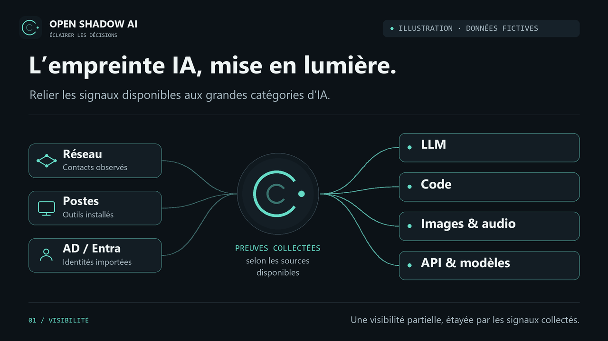
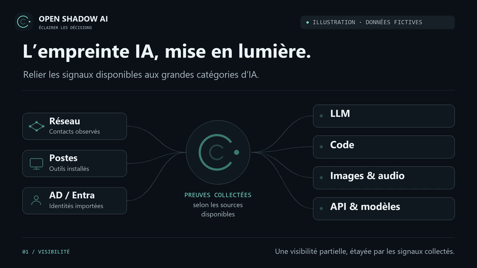
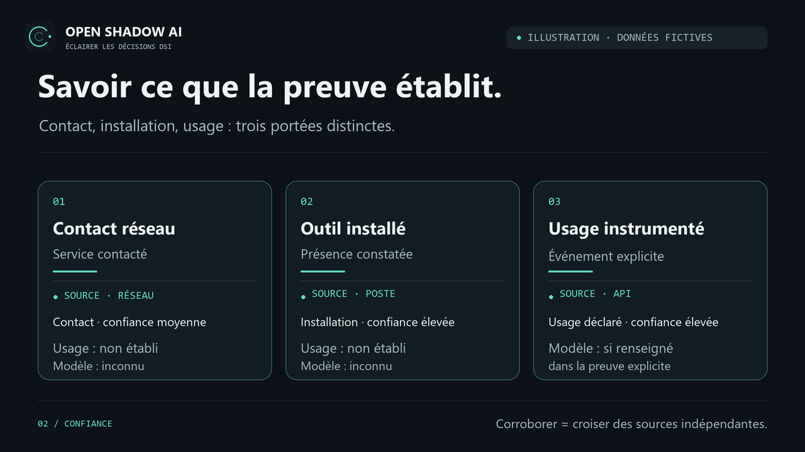
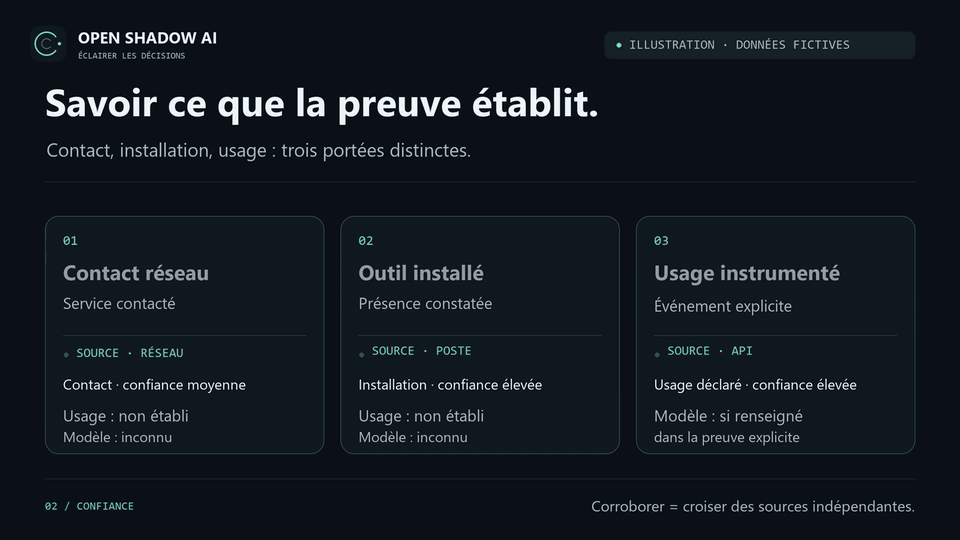
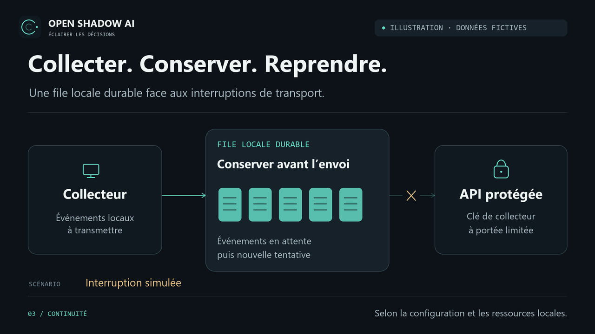
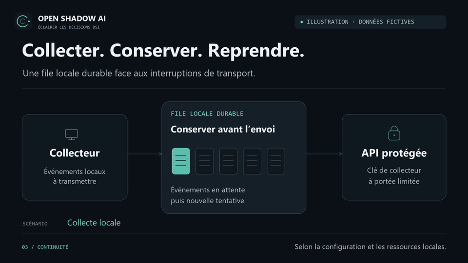

# Discovery in motion

Three silent French editorial diagrams introduce Open Shadow AI's discovery and evidence boundaries. Their shared “Éclairer les décisions” signature accompanies Open Shadow AI's aperture mark and graphite and mint palette. Every clip carries a synthetic-data label. These are illustrative flows, not product screenshots or measurements from a customer environment.

Static posters appear first below. Expand a GIF to view its looping animation, or open/download the MP4 for controlled playback. Return to the [English README](../README.md#discovery-in-motion) or the [French README](../README.fr.md#la-découverte-en-mouvement).

## AI footprint

Network metadata, endpoint inventory and AD/Entra directory signals contribute to an illustrative footprint across LLM, code, media and API categories. Contact, installed tools and directory presence provide different evidence; classification alone does not prove usage or complete coverage.

[Open/download MP4](assets/motion/footprint.mp4) · [Open static poster](assets/motion/footprint.webp)

View the AI footprint GIF

## Evidence levels

Network contact, installed assets and instrumented usage remain distinct. A domain observation is not a prompt, and an installed tool is not proof of use. Model identifiers require explicit evidence; tokens and costs require instrumentation.

[Open/download MP4](assets/motion/evidence.mp4) · [Open static poster](assets/motion/evidence.webp)

View the evidence levels GIF

## Collector resilience

The flow illustrates a bounded, durable local spool, scoped API authentication and retry after an interruption. Recovery remains subject to queue limits, retention and source visibility; it does not guarantee zero loss, full coverage or automatic enforcement. See [collector operations](collector-operations.md) for the implemented delivery and recovery boundaries.

[Open/download MP4](assets/motion/resilience.mp4) · [Open static poster](assets/motion/resilience.webp)

View the collector resilience GIF

## Formats and reproduction

The READMEs embed one GIF and link to MP4 and static WebP alternatives. GitHub resolves repository-relative image and file paths against the current branch, as described in [GitHub's README documentation](https://docs.github.com/en/repositories/managing-your-repositorys-settings-and-features/customizing-your-repository/about-readmes#relative-links-and-image-paths-in-markdown-files). The MP4 files are linked, without assuming an inline README video player. GitHub recommends H.264 for broad video compatibility in its [attachment documentation](https://docs.github.com/en/get-started/writing-on-github/working-with-advanced-formatting/attaching-files#supported-file-types).

See the [motion source and reproduction guide](../tools/motion/README.md) to regenerate the diagrams and media.
