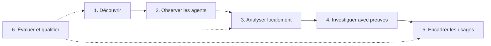

# Roadmap — voir l’IA, garder la maîtrise

**Voir l’IA. Comprendre le risque. Garder le contrôle.** Demain, suivre un service inconnu jusqu’à ses agents, retrouver les preuves d’un incident et choisir un usage autorisé devrait tenir dans une même investigation.

Cette roadmap décrit **six étapes futures, planifiées ou exploratoires** : une direction, sans dates ni promesse de livraison. Chaque passage dépend de résultats reproductibles et d’une revue humaine. Les technologies citées sont des candidates, pas des dépendances installées ou des partenariats ; références consultées le **7 octobre 2026**.

## Le socle disponible aujourd’hui

Open Shadow AI rapproche un catalogue et des règles déterministes avec des [observations réseau](network-analysis.md), des inventaires de postes et des [signaux AD/Entra](microsoft.md). L’[architecture](architecture.md) distingue présence, observation et usage instrumenté ; les files des collecteurs restent bornées. [OIDC/SCIM](sso-scim.md) est facultatif. Les [recettes de qualification](production-qualification.md) ne certifient pas un parc AD, un fournisseur d’identité ou un cluster réel.

Aujourd’hui : une organisation par installation, aucun moteur d’inférence intégré. Les signatures Ollama/vLLM servent à découvrir des outils ; elles ne les connectent pas. Un nom DNS ne révèle ni prompt, ni tokens, ni facture.

## Six étapes, six bénéfices

| Étape | Priorité envisagée | Ce que vous gagnez |
|---|---|---|
| 1. Empreinte IA | Prochaine — planifiée | Des sources reliées, des inconnues visibles |
| 2. Shadow Agent | Prochaine — planifiée | Des chaînes d’agents et d’outils compréhensibles |
| 3. Analyse locale | Ensuite — planifiée | Une aide IA compatible avec vos contraintes |
| 4. Copilote d’investigation | Ensuite — planifiée | Des réponses vérifiables, avec leurs preuves |
| 5. Usages encadrés | Ensuite — planifiée | Des règles explicites, réversibles et auditables |
| 6. Qualification | Continue — planifiée ; recherche exploratoire | Des progrès démontrés avant adoption |

La qualification accompagne chaque étape du parcours envisagé.

## 1. Une empreinte IA qui montre aussi les zones inconnues

Relier identités, machines, processus et services dans le temps aiderait à comprendre une apparition, avec la provenance et la confiance de chaque rapprochement. Les associations AD/Entra, DHCP et NAT resteraient explicites : un poste partagé ou une attribution ambiguë doit pouvoir rester inconnu.

Enrichir les imports existants de [Zeek](https://zeek.org/about/) et évaluer [Tetragon/eBPF](https://tetragon.io/docs/) sur Linux ouvrirait de nouvelles corrélations, sans prétendre à une équivalence Windows. Collecte facultative de métadonnées ; ECH, DoH et visibilité QUIC limitée resteraient affichés, sans déchiffrement des contenus.

**Passage :** publier précision/rappel par catégorie IA et niveau de preuve sur un corpus synthétique annoté, avec un lot réservé à l’évaluation, taux de couverture manquante, ambiguïtés d’attribution, latence et surcharge mesurées, puis vérifier rejeu et retour arrière.

## 2. Le Shadow AI devient aussi le Shadow Agent

Voir quels agents appellent quels outils rendrait leurs chaînes d’action investigables. Des adaptateurs [MCP](https://modelcontextprotocol.io/specification/latest/basic/security_best_practices) pour les serveurs d’outils et [A2A](https://a2a-protocol.org/latest/specification/) pour les tâches entre agents seraient évalués.

Les [traces OpenTelemetry GenAI](https://github.com/open-telemetry/semantic-conventions-genai/blob/main/docs/gen-ai/README.md) apporteraient fournisseur, modèle, appels d’outils, tokens et latence **uniquement lorsque l’instrumentation les rapporte**. Les conventions GenAI/MCP sont en statut *Development* : mappings versionnés et compatibilité testée. Aucun calcul de tokens ou facture depuis DNS/SNI.

Autorisations MCP restreintes, audience validée, métadonnées d’outils non fiables expurgées, aucun relais de jetons et collecte bornée par identité guideraient ces adaptateurs.

**Passage :** valider contrats, pannes, confidentialité et continuité des traces avec des fixtures, conserver les champs inconnus et exclure les prompts bruts par défaut.

## 3. Une analyse IA qui peut rester chez vous

Repérer des signaux inhabituels et rapprocher des observations pourrait combiner règles, embeddings et petits modèles locaux, sur activation volontaire. [Ollama](https://docs.ollama.com/faq) serait évalué en mode local avec fonctions cloud explicitement désactivées et déploiement sans sortie réseau. [vLLM](https://docs.vllm.ai/en/stable/features/structured_outputs/) serait une option de service GPU avec sorties JSON structurées, selon matériel et coût ; aucun GPU obligatoire. Respecter un schéma ne prouve pas une réponse.

Le choix des modèles comparerait qualité français/anglais, licence, contexte, résistance aux injections, latence et ressources, avec artefacts et empreintes reproductibles. Des fournisseurs cloud approuvés resteraient facultatifs et configurables, sans transfert de données brutes par défaut. Aucun entraînement autonome en ligne ni promotion fondée sur l’autoévaluation du modèle.

**Passage :** comparer au socle déterministe sur le corpus réservé, mesurer calibration, inconnues, dérive, latence à froid et CPU/RAM/VRAM, puis démontrer le repli déterministe lorsque l’IA est désactivée ou indisponible.

## 4. Un copilote d’investigation qui cite ses preuves

« Pourquoi ce service apparaît-il ici ? » appellerait une réponse sourcée, datée, ou une abstention. Une recherche hybride RAG et un graphe de connaissances relieraient événements et politiques autorisés ; le graphe n’impose pas de base dédiée. [Qdrant](https://qdrant.tech/documentation/search/hybrid-queries/) serait évalué pour la recherche hybride, sans remplacer les stockages actuels avant benchmark.

Les droits filtreraient les données avant recherche et embeddings, puis avant reclassement ; caches, isolation organisationnelle et suppression suivraient ces frontières. Aucune journalisation de raisonnement interne caché. [LangGraph](https://docs.langchain.com/oss/python/langgraph/overview) serait candidat pour des parcours bornés avec points de contrôle humains durables, d’abord en lecture seule, sans shell ni identifiants non revus.

**Passage :** mesurer fidélité et citations, tester refus d’accès, isolation, injections dans les documents et cas français difficiles, puis comparer le temps d’investigation sans inventer de gain.

## 5. Protéger les usages sans freiner les équipes

Une passerelle ou un SDK volontairement instrumenté et autorisé permettrait d’appliquer des règles aux contenus effectivement accessibles. [Presidio](https://presidio.dataprivacystack.org/), des motifs de secrets et un OCR multimodal local seraient évalués pour l’expurgation, sans garantie absolue ni inspection passive des prompts.

Les politiques pourraient choisir des fournisseurs approuvés selon le risque, contrôler les schémas de sortie et fixer des quotas à partir d’usages rapportés et de tarifs versionnés. Toute modification externe ou destructive demanderait simulation, approbation humaine, audit et retour arrière ; aucun blocage décidé par le seul modèle.

**Passage :** mesurer précision/rappel de l’expurgation et faux positifs sur des scénarios métier, vérifier l’absence de persistance des contenus par défaut et documenter, pour chaque panne, maintien ou refus du trafic avec décision déterministe.

## 6. Une plateforme qui prouve ses progrès

Chaque évolution aurait sa fiche de benchmark versionnée : corpus, faux positifs/négatifs, couverture et inconnues, latence, ressources et coût. Des tests reliés aux menaces [OWASP GenAI/Agentic](https://genai.owasp.org/), avec [NVIDIA garak](https://github.com/NVIDIA/garak) et [Microsoft PyRIT](https://github.com/microsoft/PyRIT), seraient exécutés uniquement en laboratoire autorisé et isolé, sur fixtures et budgets bornés.

Manifestes des modèles, données et outils, licences, empreintes et analyse des dépendances prolongeraient les [contrôles de provenance et signature](production-delivery.md#images-and-retained-build-evidence) sans revendiquer de certification. Les changements de modèle passeraient par évaluation en parallèle, déploiement témoin, promotion manuelle et restauration possible.

**Passage :** publier ces mesures et qualifier IdP/MFA, parc AD, Kubernetes, sauvegarde/restauration, RPO/RTO et profils de panne/charge sur des environnements réels, avec leurs limites propres.

Détection sémantique ou multimodale, tendances de parc préservant la confidentialité et apprentissage fédéré resteraient **des recherches**, après définition des frontières de données et d’isolation, puis revue des menaces. Ce sont des explorations, pas des fonctionnalités promises.

## Construisons la prochaine étape

Un angle mort concret, un connecteur ciblé ou un corpus synthétique peut faire avancer cette roadmap. [Proposez un cas d’usage](https://github.com/alebgl77/open-shadow-ai/issues/new?template=feature_request.yml), avec la preuve disponible, vos contraintes et un critère mesurable ; apportez fixtures, benchmarks et cas négatifs selon le [guide de contribution](../CONTRIBUTING.md).
