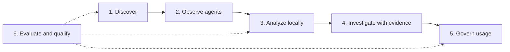

# Roadmap — see AI, retain control

[English](roadmap.md) | [Français](fr/roadmap.md) | [简体中文](zh-CN/roadmap.md)

**See AI. Understand the risk. Retain control.** In the future, tracing an unknown service to its agents, finding an incident's evidence and choosing an authorized use should fit into a single investigation.

This roadmap describes **six future stages, planned or exploratory**: a direction without dates or delivery commitments. Every transition depends on reproducible results and human review. Named technologies are candidates, not installed dependencies or partnerships; references were consulted on **7 October 2026**.

## The foundation available today

Open Shadow AI combines a catalog and deterministic rules with [network observations](network-analysis.md), endpoint inventories and [AD/Entra signals](microsoft.md). The [architecture](architecture.md) distinguishes presence, observation and instrumented usage; collector queues remain bounded. [OIDC/SCIM](sso-scim.md) is optional. [Qualification procedures](production-qualification.md) do not certify an AD fleet, identity provider or real cluster.

Today: one organization per installation, with no integrated inference engine. Ollama/vLLM signatures discover tools; they do not connect to them. A DNS name reveals no prompt, tokens or invoice.

## Six stages, six benefits

| Stage | Proposed priority | What you gain |
|---|---|---|
| 1. AI footprint | Next — planned | Connected sources, visible unknowns |
| 2. Shadow Agent | Next — planned | Understandable agent and tool chains |
| 3. Local analysis | Later — planned | AI assistance compatible with your constraints |
| 4. Investigation copilot | Later — planned | Verifiable answers with supporting evidence |
| 5. Governed usage | Later — planned | Explicit, reversible, auditable rules |
| 6. Qualification | Continuous — planned; exploratory research | Demonstrated progress before adoption |

Qualification accompanies every stage of the proposed journey.

## 1. An AI footprint that also shows unknown areas

Connecting identities, machines, processes and services over time would help explain an appearance, with the provenance and confidence of every association. AD/Entra, DHCP and NAT associations would remain explicit: a shared endpoint or ambiguous attribution must be able to remain unknown.

Enriching existing [Zeek](https://zeek.org/about/) imports and evaluating [Tetragon/eBPF](https://tetragon.io/docs/) on Linux would enable new correlations without claiming Windows equivalence. Metadata collection would be optional; ECH, DoH and limited QUIC visibility would remain visible, without content decryption.

**Gate:** publish precision/recall by AI category and evidence level on an annotated synthetic corpus, with a held-out evaluation set, missing-coverage rates, attribution ambiguities, measured latency and overhead, then verify replay and rollback.

## 2. Shadow AI also becomes Shadow Agent

Seeing which agents call which tools would make their action chains investigable. [MCP](https://modelcontextprotocol.io/specification/latest/basic/security_best_practices) adapters for tool servers and [A2A](https://a2a-protocol.org/latest/specification/) adapters for tasks between agents would be evaluated.

[OpenTelemetry GenAI traces](https://github.com/open-telemetry/semantic-conventions-genai/blob/main/docs/gen-ai/README.md) would provide provider, model, tool calls, tokens and latency **only when instrumentation reports them**. GenAI/MCP conventions have *Development* status: mappings must be versioned and compatibility tested. No tokens or invoices would be calculated from DNS/SNI.

Restricted MCP permissions, validated audiences, sanitized untrusted tool metadata, no token forwarding and collection bounded by identity would guide these adapters.

**Gate:** validate contracts, failures, privacy and trace continuity with fixtures, preserve unknown fields and exclude raw prompts by default.

## 3. AI analysis that can remain on your infrastructure

Identifying unusual signals and connecting observations could combine rules, embeddings and small local models with explicit opt-in. [Ollama](https://docs.ollama.com/faq) would be evaluated in local mode with cloud features explicitly disabled and deployment without network egress. [vLLM](https://docs.vllm.ai/en/stable/features/structured_outputs/) would be a GPU-service option with structured JSON outputs, depending on hardware and cost; no GPU would be mandatory. Schema compliance does not prove an answer.

Model selection would compare French/English quality, licensing, context, injection resistance, latency and resources, with reproducible artifacts and fingerprints. Approved cloud providers would remain optional and configurable, without raw-data transfer by default. No autonomous online training or promotion based on model self-evaluation.

**Gate:** compare against the deterministic baseline on the held-out corpus, measure calibration, unknowns, drift, cold latency and CPU/RAM/VRAM, then demonstrate deterministic fallback when AI is disabled or unavailable.

## 4. An investigation copilot that cites its evidence

“Why does this service appear here?” would call for a sourced, dated answer or abstention. Hybrid RAG search and a knowledge graph would connect authorized events and policies; the graph does not require a dedicated database. [Qdrant](https://qdrant.tech/documentation/search/hybrid-queries/) would be evaluated for hybrid search without replacing current stores before benchmarking.

Permissions would filter data before search and embeddings, then before reranking; caches, organizational isolation and deletion would follow those boundaries. No logging of hidden internal reasoning. [LangGraph](https://docs.langchain.com/oss/python/langgraph/overview) would be a candidate for bounded workflows with durable human checkpoints, initially read-only, without shells or unreviewed credentials.

**Gate:** measure faithfulness and citations, test access refusal, isolation, document injections and difficult French cases, then compare investigation time without inventing gains.

## 5. Protect usage without slowing teams

An explicitly instrumented and authorized gateway or SDK would allow rules to apply to content that is actually accessible. [Presidio](https://presidio.dataprivacystack.org/), secret patterns and local multimodal OCR would be evaluated for redaction, without absolute guarantees or passive prompt inspection.

Policies could select approved providers according to risk, validate output schemas and set quotas based on reported usage and versioned prices. Any external or destructive change would require simulation, human approval, audit and rollback; no blocking decision would be made by the model alone.

**Gate:** measure redaction precision/recall and false positives on business scenarios, verify that content is not persisted by default, and document continued or refused traffic for every failure using deterministic decisions.

## 6. A platform that demonstrates its progress

Every development would have a versioned benchmark record: corpus, false positives/negatives, coverage and unknowns, latency, resources and cost. Tests linked to [OWASP GenAI/Agentic](https://genai.owasp.org/) threats, with [NVIDIA garak](https://github.com/NVIDIA/garak) and [Microsoft PyRIT](https://github.com/microsoft/PyRIT), would run only in authorized isolated laboratories, using fixtures and bounded budgets.

Model, data and tool manifests, licenses, fingerprints and dependency analysis would extend [provenance and signature controls](production-delivery.md#images-and-retained-build-evidence) without claiming certification. Model changes would require parallel evaluation, a canary deployment, manual promotion and possible restoration.

**Gate:** publish these measurements and qualify IdP/MFA, AD fleets, Kubernetes, backup/restore, RPO/RTO and failure/load profiles in real environments with their own limitations.

Semantic or multimodal detection, privacy-preserving fleet trends and federated learning would remain **research**, after defining data and isolation boundaries and reviewing threats. These are explorations, not promised capabilities.

## Build the next stage with us

A concrete blind spot, targeted connector or synthetic corpus can advance this roadmap. [Propose a use case](https://github.com/alebgl77/open-shadow-ai/issues/new?template=feature_request.yml) with available evidence, constraints and a measurable criterion; contribute fixtures, benchmarks and negative cases according to the [contribution guide](../CONTRIBUTING.md).
