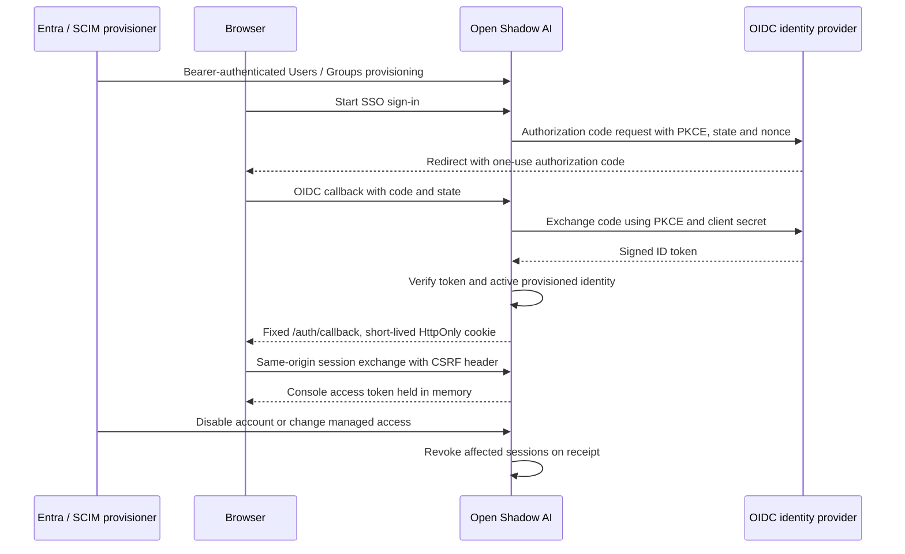

# Console sign-in and provisioning

Open Shadow AI supports optional OpenID Connect (OIDC) sign-in and a SCIM 2.0 provisioning subset for one organization per deployment. Both are disabled in the base configuration. SCIM manages **people allowed to use the console**; employee/device inventory still comes from collectors and the event API. No identity-provider certification or live Entra interoperability result is claimed.

An OIDC login must match an active, previously provisioned SCIM user. The application matches the verified issuer and a stable identity claim to the immutable SCIM `externalId`. It does not create accounts on first login, link by email, or convert existing local users. Keep a separate local administrator and test its password sign-in before enabling SSO. SCIM cannot manage local accounts.



## Public URLs and prerequisites

Use a single HTTPS origin, such as `https://ai-inventory.example.com`, serving the frontend and its existing `/api/` proxy. No additional public port is needed. The API must reach its stores and the identity provider's discovery, token and signing-key endpoints with certificate verification enabled. Redis stores short-lived login state and session handoffs.

| Purpose | URL at the public origin |
|---|---|
| Provider metadata | `/api/v1/auth/providers` |
| Start browser sign-in | `/api/v1/auth/sso/login` |
| OIDC redirect URI registered with the provider | `/api/v1/auth/sso/callback` |
| Fixed frontend completion page | `/auth/callback` |
| Same-origin session exchange | `POST /api/v1/auth/sso/session` |
| SCIM tenant URL | `/api/v1/scim/v2` |

Do not register the frontend completion page as the OIDC redirect URI. The session exchange requires `Origin` to equal the configured public origin and the header `X-SSO-CSRF: 1`. It consumes a one-use cookie; access tokens are not put in callback URLs or persistent browser storage.

## Microsoft Entra ID: sign-in

Create a dedicated **single-tenant** app registration for console access. Add a **Web** redirect URI exactly equal to `https://ai-inventory.example.com/api/v1/auth/sso/callback`; the API is a confidential server client. Create its client secret and securely retain the secret **value**. This implementation uses authorization code flow with PKCE S256; implicit/hybrid grants are unnecessary. See [Microsoft's authorization-code documentation](https://learn.microsoft.com/en-us/entra/identity-platform/v2-oauth2-auth-code-flow).

Use the directory's tenant UUID in `https://login.microsoftonline.com/TENANT-UUID/v2.0` as the exact issuer. Do not use `common`, `organizations`, a tenant-independent endpoint or an email domain as the identity key. Set `OIDC_IDENTITY_CLAIM=oid`. Map that same user's Entra **objectId** to SCIM `externalId`. The `oid` claim is a stable object identifier within a tenant; email and preferred username are mutable display/contact data. See [Microsoft's ID-token claims reference](https://learn.microsoft.com/en-us/entra/identity-platform/id-token-claims-reference).

Configure assignment and Conditional Access/MFA on the sign-in enterprise application according to your policy. The application validates the ID token but does not enforce an MFA claim itself. Console sign-in requests `openid profile`; it requires no Graph inventory permissions such as `Application.Read.All` or `Directory.Read.All`. The [Entra inventory collector](microsoft.md#entra-id) uses a separate app, credentials and permissions.

## Microsoft Entra ID: provisioning

Create a non-gallery enterprise application for SCIM provisioning, and choose automatic provisioning. Set its tenant URL to `https://ai-inventory.example.com/api/v1/scim/v2` and supply the independently generated SCIM bearer token as the secret token. Use the bearer-token method; this server does not offer a SCIM OAuth client-credentials token endpoint. Run **Test Connection**, then save. A query for an unknown user/group must return an empty SCIM list, not an authentication failure. See [Microsoft's SCIM provisioning setup](https://learn.microsoft.com/en-us/entra/identity/app-provisioning/use-scim-to-provision-users-and-groups).

Review the attribute mappings explicitly. Use these identity mappings for this application:

| Entra source | SCIM target | Purpose |
|---|---|---|
| User `objectId` | User `externalId` | Required immutable sign-in key; matches the verified OIDC `oid` |
| User `userPrincipalName` | User `userName` | Account name; not the OIDC identity key |
| User `displayName` | User `displayName` | Console display name |
| User `mail` or approved UPN fallback | User `emails[type eq "work"].value` | Contact address, not account linking |
| Account enabled / provisioning deletion expression | User `active` | Provisioning and deactivation state |
| Group `objectId` | Group `externalId` | Immutable key used for role mapping |
| Group `displayName` | Group `displayName` | Display only; changing it cannot grant a role |
| Assigned group membership | Group `members` | Console access groups |

Set `externalId` as the matching attribute where available. Remove unsupported default mappings instead of assuming the entire enterprise-user schema is accepted. Review Entra's `active` expression so account disable and removal from scope actually produce deactivation. See [Microsoft's attribute-mapping guide](https://learn.microsoft.com/en-us/entra/identity/app-provisioning/customize-application-attributes).

Start with **Sync only assigned users and groups** and a dedicated pilot group. Assign the same pilot users to the sign-in application. Enable group provisioning only for groups used to manage console access; map the actual group object IDs to roles in `SCIM_GROUP_ROLE_MAP`. The initial empty map gives provisioned users viewer access. Do not map a group by its display name.

Use **Provision on demand** for a pilot user, inspect its external ID and membership, and test sign-in before enabling regular provisioning. Then exercise account disable and group removal, including the delay before Entra sends changes. See [Microsoft's on-demand provisioning procedure](https://learn.microsoft.com/en-us/entra/identity/app-provisioning/provision-on-demand). Microsoft UI, licensing and connector capabilities must be checked in your tenant; a guide is not a completed interoperability test.

On-prem AD accounts must first be represented in your chosen OIDC provider and provisioned with its verified stable identifier. The AD export's `objectGUID`/SID is not automatically the Entra `oid`. Direct LDAP/Kerberos and SAML sign-in are not implemented here.

## Docker Compose

Run the normal bootstrap first. It continues to create exactly six base secrets. Provision two additional private files yourself:

- `secrets/oidc_client_secret.txt`: the actual client-secret value issued by your OIDC provider.
- `secrets/scim_bearer_token.txt`: an independent token generated from at least 32 cryptographically random bytes, for example 64 hexadecimal characters, shared only with the authorized SCIM provisioner.

Do not reuse the collector key, JWT key or OIDC secret for SCIM. Use your secret manager and the existing private secret-directory permissions; on Unix the mounted files must remain readable by the nonroot API user, as with the bootstrap files. On Windows apply the same restricted ACL as the existing secrets. Never put secret values in `.env`, shell history or Git.

Add non-secret settings to your private `.env`, replacing the example identifiers and hostname with real values:

```dotenv
OIDC_ISSUER=https://login.microsoftonline.com/TENANT-UUID/v2.0
OIDC_CLIENT_ID=APPLICATION-CLIENT-UUID
OIDC_PUBLIC_BASE_URL=https://ai-inventory.example.com
OIDC_LABEL=Microsoft Entra ID
OIDC_IDENTITY_CLAIM=oid
SCIM_GROUP_ROLE_MAP={}
```

The public base URL is the exact origin, with no trailing slash, path, query or fragment. Begin with an empty role map, then set a JSON object mapping reviewed **group external IDs** to `viewer`, `analyst` or `admin`. For example, replace the documentation-only UUID before using `SCIM_GROUP_ROLE_MAP='{"00000000-0000-0000-0000-000000000001":"analyst"}'`. The highest mapped group role applies; users with no mapped groups remain viewers. Local user administration cannot override a managed role. After changing the map, deploy or restart every API replica with the same map. Authentication and account listings then resolve current group roles immediately; reprovisioning is not required. Coordinate the rollout so replicas do not apply different access policies.

The optional override enables both features and mounts the additional secrets only into the API. It preserves the base API secrets and worker settings:

```bash
docker compose -f docker-compose.yml -f docker-compose.sso.yml config --quiet
docker compose -f docker-compose.yml -f docker-compose.sso.yml up -d --build
docker compose exec -T frontend nginx -s reload
```

Reload the frontend after recreating the API so nginx resolves its current container IP, including when only the API was recreated.

For an existing installation, follow the [backup and PostgreSQL migration procedure](deployment.md#updates) before startup. Use both `-f` arguments for subsequent operations on this deployment; running only the base file recreates the API with identity features disabled. `OIDC_ENABLED=false` or `SCIM_ENABLED=false` in `.env` disables the corresponding feature when the override is used. SCIM can be disabled after initial provisioning, but changes will no longer arrive until it is enabled again.

The base deployment defaults both flags to false. Enabling OIDC requires issuer, client ID, client secret and public origin. Enabling SCIM requires the issuer and bearer token. Direct deployments may use `OIDC_CLIENT_SECRET` and `SCIM_BEARER_TOKEN`, or their `_FILE` equivalents; prefer mounted files. `OIDC_IDENTITY_CLAIM` defaults to `sub`, and only `sub` or `oid` are supported. `SCIM_GROUP_ROLE_MAP` defaults to an empty object; the Compose override requires an explicit value to make the access policy visible.

## Generic OIDC and Kubernetes

For another provider, configure a confidential authorization-code client supporting discovery, PKCE S256 and RS256-signed ID tokens. Set its exact issuer and use `OIDC_IDENTITY_CLAIM=sub`, the default. Its provisioning integration must send the same client-specific stable `sub` as User `externalId`. If the provider cannot expose this mapping, complete that integration before enabling sign-in; do not substitute email or username. Verify discovery and SCIM requests against the implemented subset.

HTTPS and certificate validation remain mandatory in deployment. `OIDC_ALLOW_INSECURE_LOCALHOST=true` is an explicit development-only exception requiring loopback issuer and public origins; it is false in the shipped overrides. It is not a private-network TLS bypass.

The optional [Kubernetes identity overlay](../deploy/kubernetes/README.md#optional-oidcscim-console-access) references an operator-managed Secret and restricts the settings to the API. Replace the example IDs, origins, image digests and egress rules, validate the rendered manifests and test them on your cluster. The base overlay remains unchanged.

## Supported subset

The endpoint provides SCIM Users, Groups, discovery metadata and the following bounded operations:

| Operation | Supported contract |
|---|---|
| Resource lifecycle | Users/Groups GET, POST, PUT, PATCH and DELETE; immutable `externalId` on both resource types |
| User fields | `userName`, `externalId`, `active`, `displayName`, `name.givenName`, `name.familyName`, `emails`; groups are read-only on users |
| User PATCH | Case-insensitive Add/Replace/Remove; supported field paths or a no-path object; whole `emails` arrays and the `emails[type eq "work"].value` form |
| Group PATCH | Display name; Add/Replace/Remove `members`; Remove with a value array or `members[value eq "UUID"]`; no-path objects |
| Member identity | `members[].value` is the server-issued SCIM User `id`, not the external object ID; nested groups are unsupported |
| Filters | One quoted equality expression: Users `userName`, `externalId` or `id`; Groups `displayName`, `externalId` or `id` |
| Pagination and bounds | `startIndex` begins at 1; default `count` 100, maximum 200, `count=0` allowed; at most 100 PATCH operations and 1,000 member references per array/request; the cumulative group size may exceed 1,000 through successive requests |

DELETE hides and deactivates a user while retaining its external binding and revocation history; memberships are removed. Reprovisioning the same external ID reuses its server ID but requires fresh authentication. Provisioned accounts cannot authenticate through the local password endpoint or be linked to existing local users. Deleted/deactivated access and managed role changes invalidate affected sessions when the application receives the change; reactivation never revives old tokens.

The reference protocols are [SCIM core schema, RFC 7643](https://www.rfc-editor.org/rfc/rfc7643) and [SCIM protocol, RFC 7644](https://www.rfc-editor.org/rfc/rfc7644). This implementation does not claim every optional feature: no Bulk, full filter language, sorting, ETags, SCIM password management, SAML, automatic email linking, multiple identity providers per installation, multi-organization isolation or provider certification. Inspect `/ServiceProviderConfig`, `/Schemas` and `/ResourceTypes` under the authenticated SCIM base URL before configuring a client. Generic provider compatibility and live Entra tests remain pending.

## Pilot acceptance

1. Confirm the local recovery administrator still signs in and `/api/v1/auth/providers` exposes only the intended SSO label and login route.
2. Complete SCIM Test Connection and provision a scoped user with matching `externalId`. Verify that an unprovisioned identity cannot sign in and an email collision never links a local account.
3. Sign in through the registered HTTPS callback. Check that the session exchange uses the exact origin and that no tokens enter URLs or persistent browser storage. Test denied consent and an expired/replayed login.
4. Add/remove the pilot user in each mapped group and verify effective console permissions. Renaming a group must not change its role mapping.
5. While the user has an active console session, disable the account upstream. Record when SCIM arrives, verify the existing token is then rejected, and verify that reactivation does not revive that old token. Repeat with deprovisioning and group removal.
6. Check every proxy, ingress and tracing layer for authorization codes, tokens, cookies and secrets. Keep only sanitized diagnostic events. Test local recovery during an IdP outage.

Directory synchronization has its own schedule: revocation is effective on receipt, not at the instant an AD/Entra administrator changes an account. Console logout ends the local console session; it is not global IdP logout or a replacement for deprovisioning.

Rotate the OIDC secret and SCIM bearer token through your secret manager, coordinate the new token with the provisioner, recreate/restart the API to load the values, then rerun connection, sign-in and deactivation checks. There is no automatic rotation or overlapping-token rollout. Removing the override disables entry points but is not a substitute for explicitly revoking existing access. Restore configuration and identity data consistently from backups.

The repository checks use synthetic providers and disposable stores; review [validation scope](validation.md) and the exact commit's CI results. They do not replace these live pilot checks.
