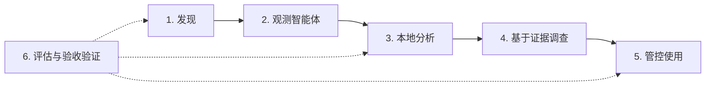

# 路线图：看清 AI，掌握主动权

[English](../roadmap.md) | [Français](../fr/roadmap.md) | [简体中文](roadmap.md)

**看清 AI，理解风险，保持掌控。** 未来，从一个陌生服务追溯到它的智能体、找到事件证据并选择获准的使用方式，应当能在同一次调查中完成。

本路线图描述**六个未来阶段，包含计划中的工作和探索性研究**，用于说明方向，不承诺日期或交付。进入下一阶段需要可复现的结果和人工评审。文中技术均为评估候选项，不代表已安装的依赖或合作关系；参考资料查阅日期为 **2026 年 10 月 7 日**。

## 当前可用的基础

Open Shadow AI 将目录中的签名和确定性规则与[网络观测（英文参考）](../network-analysis.md)、终端清单及 [AD/Entra 信号（英文参考）](../microsoft.md)相结合。[架构（英文参考）](../architecture.md)区分工具存在、实际观测与通过埋点报告的使用情况；采集器的队列设有上限。[OIDC/SCIM（英文参考）](../sso-scim.md)为可选功能。[验收验证流程（英文参考）](../production-qualification.md)不构成对实际 AD 设备群、身份提供商或集群的认证。

目前，每个部署仅服务一个组织，未集成推理引擎。Ollama/vLLM 签名用于发现这些工具，不会连接它们。DNS 名称无法揭示提示词、词元数或账单。

## 六个阶段，六项收益

| 阶段 | 预期优先级 | 带来的收益 |
|---|---|---|
| 1. AI 足迹 | 下一步：计划中 | 关联不同来源，让未知区域可见 |
| 2. 影子智能体 | 下一步：计划中 | 看清智能体与工具组成的调用链 |
| 3. 本地分析 | 后续：计划中 | 获得符合自身约束的 AI 分析辅助 |
| 4. 调查助手 | 后续：计划中 | 获得带有证据、可核验的回答 |
| 5. 使用管控 | 后续：计划中 | 建立明确、可撤销、可审计的规则 |
| 6. 验收验证 | 持续开展：计划中；研究部分为探索性工作 | 在采用之前以证据证明进展 |

验收验证贯穿所规划的每一个阶段。

## 1. 同时呈现未知区域的 AI 足迹

随着时间关联身份、设备、进程与服务，可以帮助解释一个服务为何出现，同时说明每次关联的来源信息与置信度。AD/Entra、DHCP 和 NAT 关联仍需明确记录；共享终端或无法确定的归属应当能够保留为未知。

丰富现有 [Zeek（英文参考）](https://zeek.org/about/) 导入，并评估 Linux 上的 [Tetragon/eBPF（英文参考）](https://tetragon.io/docs/)，可以拓展关联能力，但不声称 Windows 具有同等能力。元数据采集为可选功能；ECH、DoH 以及有限的 QUIC 可见性仍需明示，不解密内容。

**进入下一阶段的条件：** 在带有人工标注的合成语料上，按 AI 类别和证据级别公布精确率与召回率，使用独立留出的评估集，报告覆盖缺口比例、归属歧义，并测量延迟与额外资源开销，然后验证重放和回滚。

## 2. 从影子 AI 扩展到影子智能体

展示哪些智能体调用了哪些工具，可以让行动链成为可调查的对象。将评估用于工具服务器的 [MCP（英文参考）](https://modelcontextprotocol.io/specification/latest/basic/security_best_practices) 适配器，以及用于智能体间任务的 [A2A（英文参考）](https://a2a-protocol.org/latest/specification/) 适配器。

[OpenTelemetry GenAI 跟踪（英文参考）](https://github.com/open-telemetry/semantic-conventions-genai/blob/main/docs/gen-ai/README.md)可以提供服务商、模型、工具调用、词元数和延迟，**前提是埋点实际报告了这些信息**。GenAI/MCP 约定处于 *Development* 状态，需要版本化映射和兼容性测试。不能根据 DNS/SNI 计算词元数或账单。

适配器设计将遵循以下约束：限制 MCP 授权、验证受众、清除不可信工具元数据中的敏感信息、不转发令牌，并按身份限制采集量。

**进入下一阶段的条件：** 使用测试样例验证接口契约、故障行为、隐私和跟踪连续性，保留未知字段，并默认排除原始提示词。

## 3. 可以留在本地的 AI 分析

识别异常信号、关联不同观测，可以在明确启用后结合规则、嵌入向量与小型本地模型。将评估 [Ollama（英文参考）](https://docs.ollama.com/faq) 的本地模式，明确关闭云功能，部署时禁止出站网络访问。[vLLM（英文参考）](https://docs.vllm.ai/en/stable/features/structured_outputs/)可作为 GPU 服务选项，提供结构化 JSON 输出，具体取决于硬件和成本；GPU 并非必需。符合结构约束并不能证明回答正确。

模型选型将比较法语与英语质量、许可证、上下文长度、抵抗注入的能力、延迟和资源消耗，并保留可复现的产物与哈希值。获准的云服务商仍为可选、可配置的选项，默认不传输原始数据。不进行自主在线训练，也不依据模型的自我评估将其提升为正式版本。

**进入下一阶段的条件：** 在独立留出的语料上与确定性基础方案比较，测量校准效果、未知情况、漂移、冷启动延迟和 CPU/RAM/VRAM 消耗，并证明在 AI 被关闭或不可用时能够回退到确定性处理。

## 4. 引用证据的调查助手

“这个服务为什么会出现在这里？”应得到注明来源和日期的回答，或明确拒绝作答。混合检索增强生成（RAG）与知识图谱可以关联有权访问的事件和策略；知识图谱不要求专用数据库。将评估 [Qdrant（英文参考）](https://qdrant.tech/documentation/search/hybrid-queries/) 的混合检索能力，在完成基准测试之前不替换现有存储。

权限控制需要在检索与生成嵌入向量之前过滤数据，并在重排序之前再次过滤；缓存、组织隔离和删除也要遵循这些边界。不记录隐藏的内部推理。[LangGraph（英文参考）](https://docs.langchain.com/oss/python/langgraph/overview)可作为具有持久化人工检查点的受限流程候选方案，首先提供只读流程，不开放 shell，也不使用未经审核的凭据。

**进入下一阶段的条件：** 测量回答对证据的忠实程度和引用质量，测试访问拒绝、隔离、文档中的注入及复杂法语案例，然后比较调查耗时，不虚构效率提升。

## 5. 在保护使用的同时支持团队工作

对经授权、主动埋点的网关或 SDK，可以针对实际可见的内容执行规则。将评估 [Presidio（英文参考）](https://presidio.dataprivacystack.org/)、秘密信息匹配规则和本地多模态 OCR，用于敏感信息清除，但不作绝对保证，也不被动检查提示词。

策略可以按风险选择获准的服务商、检查输出结构，并依据报告的使用量及版本化价格设定配额。任何外部修改或破坏性操作都需要模拟运行、人工批准、审计和回滚；不能仅凭模型决定阻断。

**进入下一阶段的条件：** 在业务场景中测量敏感信息清除的精确率、召回率和误报，验证默认不持久化内容，并为每种故障记录是继续放行还是拒绝流量，以确定性逻辑作出决定。

## 6. 用证据证明进展的平台

每次演进都应附有版本化基准报告，涵盖语料、误报与漏报、覆盖范围与未知情况、延迟、资源消耗和成本。与 [OWASP GenAI/Agentic（英文参考）](https://genai.owasp.org/) 威胁对应的测试，以及使用 [NVIDIA garak（英文参考）](https://github.com/NVIDIA/garak) 和 [Microsoft PyRIT（英文参考）](https://github.com/microsoft/PyRIT) 的测试，只能在经授权的隔离实验环境中执行，使用测试样例并限定预算。

模型、数据和工具清单，以及许可证、哈希值和依赖分析，将扩展现有的[来源信息与签名检查（英文参考）](../production-delivery.md#images-and-retained-build-evidence)，但不声称获得认证。模型变更需要经过并行评估、金丝雀部署、人工提升为正式版本，并保留恢复能力。

**进入下一阶段的条件：** 公布这些测量结果，在真实环境中验证 IdP/MFA、AD 设备群、Kubernetes、备份与恢复、RPO/RTO，以及故障和负载场景，并记录各自的边界。

语义或多模态检测、保护隐私的设备群趋势分析和联邦学习仍属于**研究**，需要先定义数据与隔离边界，再进行威胁评审。这些是探索方向，不是承诺交付的功能。

## 一起推进下一阶段

一个具体盲区、一个范围明确的连接器，或一组合成语料，都可以推动本路线图。[提出使用场景](https://github.com/alebgl77/open-shadow-ai/issues/new?template=feature_request.yml)，说明已有证据、约束和可测量的标准；按照[贡献指南（英文参考）](../../CONTRIBUTING.md)提供测试样例、基准结果和反例。
